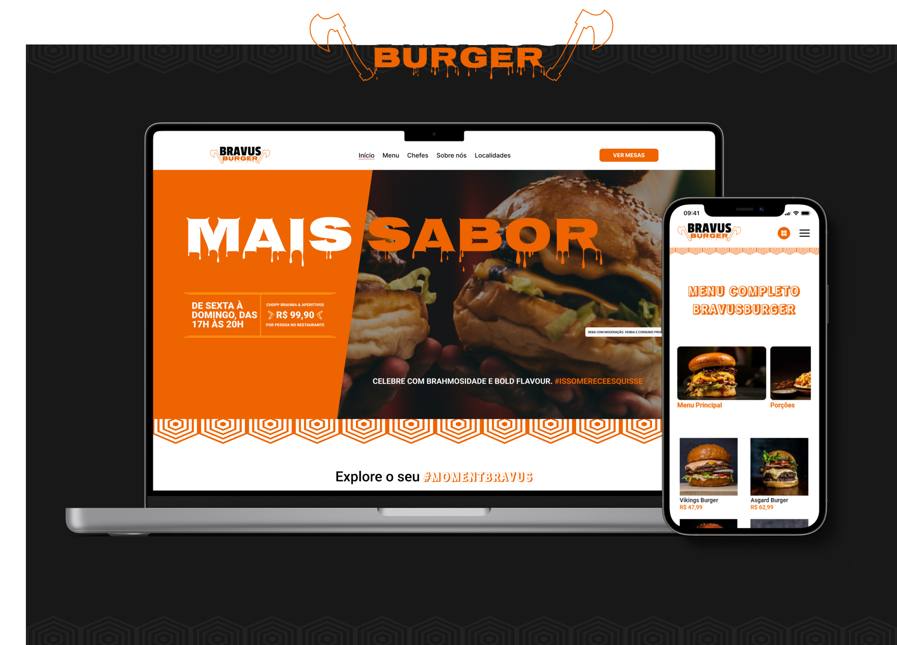

# Bravus Burger Website

Sistema de pedidos de um restaurante.
Um site totalmente voltado para a experiência do usuário em aparelhos móveis (Mobile), onde o cliente só consegue acessar através de um QRCode.

A interface foi construída pensando em uma usabilidade como se fosse um App, para que o cliente se sinta confortável durante o uso do site como se estivesse em um app nativo sem a necessidade de Downloads.

Todos os tons de cores e contrastes foram delicadamente pensados na acessibilidade do usuário final e com o tema proposto ( Um site de conteúdo alimentício ), onde foram utilizados tons quentes ( Laranja ).

O site possui todo o menu, descrição dos alimentos, observações de ingredientes, entre outras funcionalidades. E o melhor, é totalmente intuitivo e fácil de utilizar!

# 🧠 Funcionalidades

O projeto tem todas funcionalidades para facilitar a vida dos funcionários do restaurante, tanto dos garçons quanto dos responsáveis pela cozinha. Dentre as funcionalidades, o usuário pode:

- ✔️ Abrir uma comanda
- ✔️ Fazer pedidos
- ✔️ Cancelar pedidos
- ✔️ Adicionar itens a um pedido
- ✔️ Ver itens de um pedido realizado
- ✔️ Adicionar e remover itens do carrinho
- ✔️ Ver todo o menu do restaurante
- ✔️ Acessar informações dos produtos
- ✔️ Avaliação de qualidade dos serviços
- ✔️ Tudo é atualizado em tempo real

## 🖥️ Tecnologias Utilizadas

## Frontend 😁🤩

- React.JS - Framework para interfaces de usuário
- Vite.JS - Build tool para organizar projeto
- Typescript - Superset de Javascript
- Styled-components - Estilização in JS
- React-router-dom - Biblioteca para roteamento de páginas
- Git - Versionamento de códigos
- API Rest - Comunicação com o sistema do Backend
- Dotenv - Para ativar variáveis de ambiente
- Figma - Design da interface do projeto

## Configuração do projeto ⚙️⚙️

- ESlint
- Prettier

## Colaboradores 🤝🤝

<table>
  
<td>

| Foto                                                           | Nome                                                |
| -------------------------------------------------------------- | --------------------------------------------------- |
|  | [Lucas Eduardo](https://github.com/lucaseduardocrp) |

</td>

<td>

| Foto                                                       | Nome                                                 |
| ---------------------------------------------------------- | ---------------------------------------------------- |
|  | [Alexandre Retamero](https://github.com/aleretamero) |

</td>

</table>

